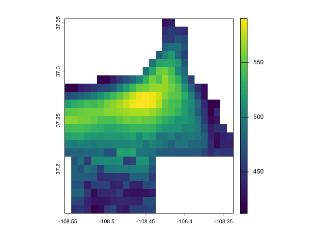

<!-- README.md is generated from README.Rmd. Please edit that file -->

# paleocar_v2

<!-- badges: start -->

<!-- badges: end -->

**DEPRECATION WARNING**

The PaleoCAR v2 dataset has been superceded by the [PaleoCAR v3
dataset](https://github.com/bocinsky/paleocar_v3). New analyses should
use those data.

------------------------------------------------------------------------

This is an archive of the PaleoCAR v2 paleoclimate reconstruction
datasets originally published in Science Advances:

> R. Kyle Bocinsky, Johnathan Rush, Keith W. Kintigh and Timothy A.
> Kohler, 2016: Exploration and exploitation in the macrohistory of the
> pre-Hispanic Pueblo Southwest. Science Advances, 2(4), [DOI:
> 10.1126/sciadv.1501532](https://doi.org/10.1126/sciadv.1501532).

The dataset is available as tiled NetCDF files as part of the NOAA
National Centers for Environmental Information Paleoclimate archive at
[DOI: 10.25921/8ctk-8v26](https://doi.org/10.25921/8ctk-8v26).

The PaleoCAR v2 data are high spatial resolution (30 arc-second)
Southwestern United States tree-ring reconstructions of Growing Degree
Days (May–September) and Net Water-year Precipitation
(October–September). The reconstructions were performed using the
“PaleoCAR” method detailed in Bocinsky and Kohler (2014), as updated in
Bocinsky et al. (2016).

The script in this repository downloads the archived tiled data, mosaics
them together, writes them as cloud-optimized GeoTIFFs, and uploads them
to an Amazon AWS S3 bucket at
<https://skope.s3.us-west-2.amazonaws.com/index.html>. These files are
then able to be queried remotely.

Here are two reconstructions that are part of the PaleoCAR v2 dataset:

- **Growing-season Growing Degree Days (May–September)**:  
  <https://skope.s3.us-west-2.amazonaws.com/paleocar_v2/gdd_maize_maysept/prediction_scaled.tif>
- **Net Water-year Precipitation (October–September)**:  
  <https://skope.s3.us-west-2.amazonaws.com/paleocar_v2/ppt_wateryear/prediction_scaled.tif>

------------------------------------------------------------------------

## Demonstration

Cloud-optimized GeoTIFFs stored in S3 buckets can be read by GDAL
directly and queried or cropped to an area of interest, without having
to download the entire dataset. For example, here we crop the PaleoCAR
v2 Precipitation dataset to the Mesa Verde cuesta and find the average
net water-year precipitation from AD 600–1300.

``` r
library(terra)
#> terra 1.8.86
library(FedData)
#> You have loaded FedData v4.
#> As of FedData v4 we have retired
#> dependencies on the `sp` and `raster` packages.
#> All functions in FedData v4 return `terra` (raster)
#> or `sf` (vector) objects by default, and there may be
#> other breaking changes.

terra::rast(
  "https://skope.s3.us-west-2.amazonaws.com/paleocar_v2/ppt_wateryear/prediction_scaled.tif",
  vsi = TRUE #Ensure that terra uses vsicurl for remote access
) |>
  terra::subset(
    subset = 600:1300
  ) |>
  terra::crop(
    terra::vect(FedData::meve),
    mask = TRUE
  ) |>
  mean() |>
  plot()
```

<!-- -->
